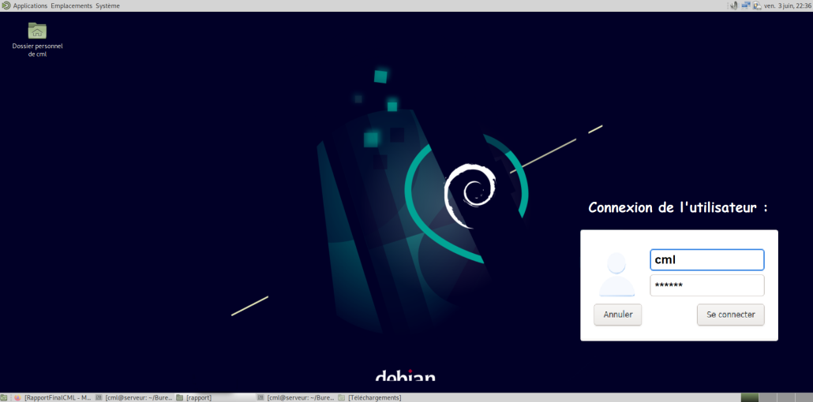
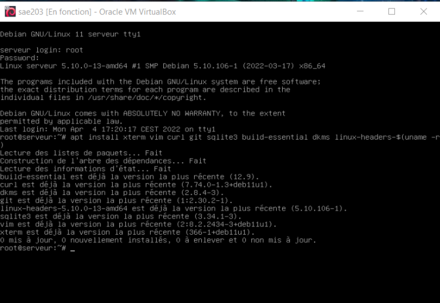
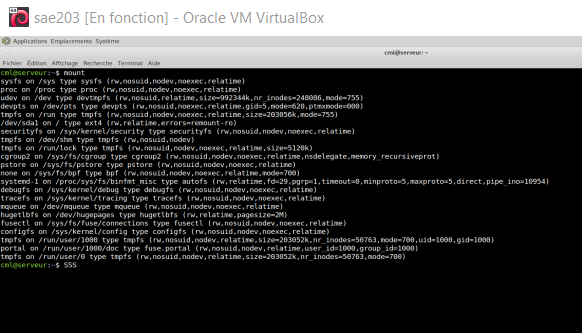
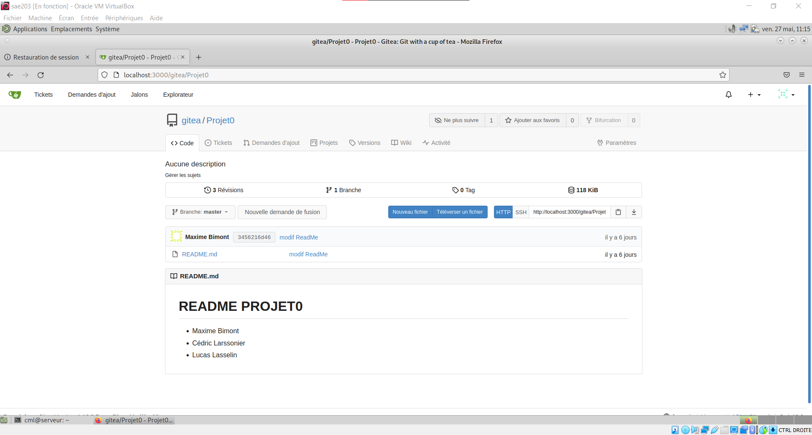
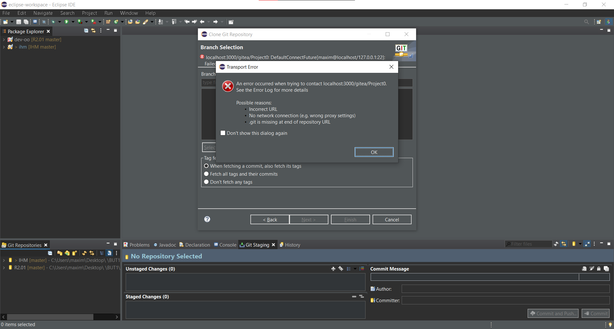
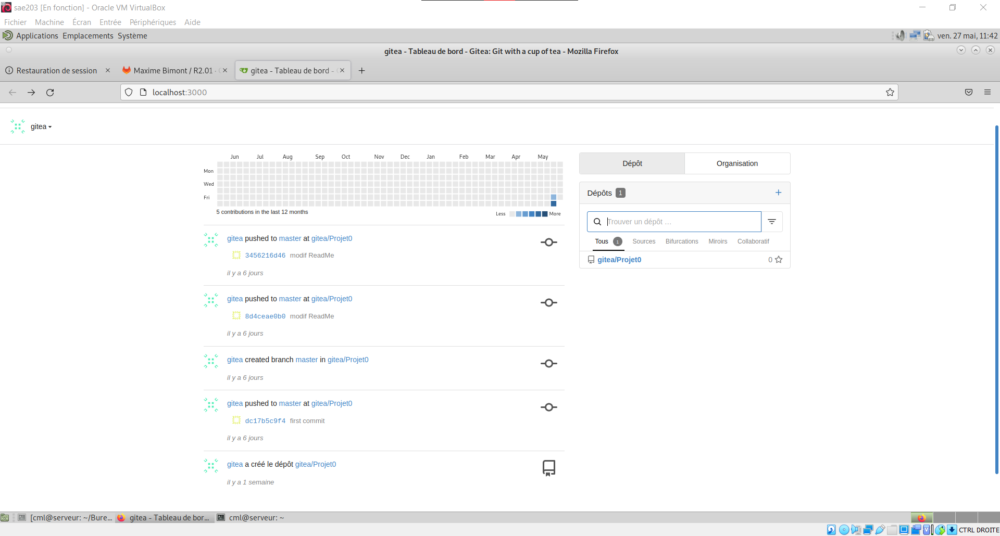

## Introduction

### Présentation

Lors de ce mardi 19 mars 2022, nous avons commencé cette SAÉ 2.03, elle consiste à créer un réseau à partir d’une machine virtuelle (Virtualbox).
Le but étant d'installer une application permettant un travail collaboratif à distance.

Nous avons choisi d’installer la machine virtuelle sur un ordinateur personnel pour y avoir accès régulièrement.

### Conversion Markdown à HTML

Pour la convertion, nous avons installé le paquet pandoc qui était déjà sur les repo apt de debian. Ensuite, nous avons créé un fichier "header.html" qui contient le code suivant :

```html
<h2>SAÉ 2.03</h2>
<h4 align="center">Maxime Bimont  |  Cédric Larsonnier  |  Lucas Lasselin</h4>
<hr>
<h1>Rapport Final : Installation d’un service réseau</h1>
<h3>Table des Matières</h3>
```

Nous avons utilisé [un fichier css sur github](http://markdowncss.github.io/modest/) qui est un fichier css déjà stylisé pour être utilisé avec Markdown. Nous l'avons renommé `style.css`.

Enfin pour réaliser la conversion on utilise cette commande :

```bash
pandoc -s --toc -c style.css -H header.html RapportFinalCML.md -o RapportFinalCML.html
```

- Pandoc est le logiciel
- `--toc` : permet de créer une table des matières cliquable en haut de la page
- `-H` header.html : permet d'ajouter le contenu de notre en-tête tout au-dessus de la page
- RapportFinalCML.md est le nom de notre fichier markdown d'entrée
- `-o` RapportFinalCML.html : permet de nommer le fichier de sortie en .html

## Préparation d’une machine virtuelle Debian

### Les prérequis

Nous avions comme prérequis, pour créer la **machine Debian** :

- 4 Go de RAM
- 20 Go d’espace disque
- Le système d'exploitation Debian (64-bit)

Le 64-bit signifie que l'architecture peut exploiter plus de 4 Go de RAM.

L’acronyme **RAM** qui signifie Random Access Memories, est la mémoire vive  de l’ordinateur. C’est ce qui va permettre à ce que l’ordinateur
soit rapide et réactif à chaque action de l’utilisateur.

Le réseau de type **NAT** (Network Address Translation) est par défaut. NAT est un **processus de modification des adresses IP** et des ports sources et destination.

Lors de l'installation de la machine, un fichier nommé **sae203.vbox-prev** c’est créé avec toutes les informations en rapport à sa configuration et son nom.
Notre machine linux sous **Debian (64-bit)** a comme nom "sae203" et “serveur” comme nom interne, avec aucun nom de domaine.

[Source Processeur 64bit](https://fr.wikipedia.org/wiki/Processeur_64_bits)

[Source RAM](https://fr.wikipedia.org/wiki/M%C3%A9moire_vive)

[Source NAT](https://fr.wikipedia.org/wiki/Network_address_translation)

### L'architecture et son fonctionnement

L'architecture de la machine debian utilisé est l'environnement MATE qui est basé sur GNOME.
Il permet d’avoir les logiciels libre, open sources, GNOME et l’affichage de l'environnement.

Pour installer toute la VM, nous avons utilisé un fichier .iso qui va permettre d’installer toutes les informations déjà données.
Il est possible d’installer un .iso sur une clé USB pour installer l'environnement de son choix sur n’importe quels ordinateurs, on parle alors de clé bootable.

Pour la suite du projet, il faut savoir quel outil utiliser pour faire un serveur distant :

- Le ssh est un protocole de communication sécurisé, cela vas nous permetre de nous connecter au seveur tout en etant sécurisé.
- Un serveur web va nous permettre de faire l'envoie de flux de streaming, le stockage de données ou encore prendre en service l'envoie de l'email.
- Les proxys vont faire un lien entre les serveurs et internet.

Voici un aperçu de l'écran d'acceuil de la VM :



[Source Ssh](https://fr.wikipedia.org/wiki/Secure_Shell)

[Source serveur Web](https://fr.wikipedia.org/wiki/Serveur_web)

[Source proxy](https://fr.wikipedia.org/wiki/Proxy)

## Préparation du système

### Sudo

La commande sudo permet de lancer des commandes Linux en commande admisnistrateur.
Pour savoir à quels groupes appartient l'utilisateur user, on se dirige dans le répertoire etc/ et entrons la commande :

```bash
cat group | grep cml
```

**cml** est le nom de l'utilisateur.

### Installation outils

Cette commande va installer des outils utiles à la machine virtuelle comme un éditeur, des packages ou encore une bibliothèque.

```bash
apt install xterm vim curl git sqlite3 build-essential dkms linux-headers-$(uname -r)
```



Outils installés :

- **xterm** : est un **terminal d'émulation** tel que terminal gnome.

- **vim** : est un **éditeur de texte** utilisé pour le terminal sous GNU/linux.

- **curl** : est utilisé en ligne de commande pour **transférer des données**.

- **git** : est un **open source** conçu pour tous gérer, que ca soit des petits comme des grands projets, rapidement.

- **sqlite3** : est une **bibliothèque** proposant un moteur de base de données.

- **build-essential** : ce sont des paquets qui sont considérés **essentiels pour construire des paquets Debian**.

- **dkms** : permet de **construire dynamiquement des modules** du noyau pour chaque noyau de votre système de manière simplifié et organisé.

- **linux-header** : est utilisé pour **compiler des pilotes et des modules chargeables** qui ajoutent du support au noyau.

[Source xterm](https://doc.ubuntu-fr.org/xterm)

[Source vim](https://doc.ubuntu-fr.org/vim)

[Source curl](https://curl.se/)

[Source git](https://git-scm.com/)

[Source sqlite3](https://doc.ubuntu-fr.org/sqlite)

[Source build-essential](https://packages.debian.org/fr/sid/build-essential)

[Source dkms](https://fr.wikipedia.org/wiki/Dynamic_Kernel_Module_Support)

[Source linux headers](https://wiki.gentoo.org/wiki/Linux-headers)

### Suppléments invités

Pour trouver et connaître le noyau Linux de notre VM :

```bash
uname -r
```

- (5)  Version principale du noyau
- (10) Version majeure
- (0)  Niveau de révision mineure
- (13) Niveau de correctif et des corrections de bugs
- (amd64) **amd64** est une architecture 64 bit officiel de Debian

[Source Noyau](https://www.quennec.fr/trucs-astuces/syst%C3%A8mes/gnulinux/commandes/la-commande-mount)

Les suppléments invité permettent :

- Un affichage graphique plus rapide et automatiquement adapté à la résolution graphique du système hôte,
- Le partage du presse-papier.

[Source Invité](https://doc.ubuntu-fr.org/virtualbox_additions_invite)

#### La commande mount



Une fois la commande mount exécutée, le répertoire indiqué devient le **répertoire racine du nouveau système** de fichiers monté.

[Source Mount](https://www.quennec.fr/trucs-astuces/syst%C3%A8mes/gnulinux/commandes/la-commande-mount)

## Sélection d'un frontend

### Préliminaire

- **Gitk** est un outil de **visualisation graphique** d'historique utilisé lorsque vous essayé de trouver un évènement passé ou de visualiser l'historique de votre projet.
- **Git-gui** est un outil permettant les **opérations courantes avec git** , implémenté en **Tcl/Tk**. Tcl qui est un language de script inspiré du C et Tk une librairie 
pour créer des interfaces graphiques portables.

Pour installer ces deux applications, on entre dans le terminal la commande :

```bash
sudo apt-get install gitk git-gui
```

Puis terminer par la commande suivante pour vérifier s'il n'existe pas des mises à jour disponibles des applications installées :

```bash
sudo apt-get update
```

[Source Gitk](https://git-scm.com/docs/gitk)

[Source Git-gui](https://git-scm.com/docs/git-gui)

[Source Tcl/Tk](https://fr.wikipedia.org/wiki/Tool_Command_Language)

### Comparons

Nous avons choisis d'installer le logiciel **Ungit** car en apparence il affichait une **interface visuelle intéressante**.
Ainsi qu'un historique des commits possédant une **diversification variée** dans sa capacité à informer l'utilisateur sur ses commits depuis git.

Pour cela, nous avons procédé en installant au préalable les applications suivantes :

- **Node.js** : il s'agit plutôt d'un environnement d'éxécution qui est utilisé pour **exécuter JavaScript en dehors du navigateur**.
- **NPM** ou Node Package Manager, qui est un outil **gérant les bibliothèques de programmation JavaScript pour Node.js**.

Voici la commande pour installer ces deux applications :

```bash
sudo apt install nodejs npm
```

Ensuite il suffit d'installer notre logiciel Ungit, choisis précédemment :

```bash
sudo -H npm install -g ungit
```

[Source Ungit](https://grafikart.fr/tutoriels/ungit-437)

[Source Node.js](https://nodejs.org/en/)

[Source NPM](https://www.npmjs.com/)

Pour terminer, nous allons **comparer** le logiciel que nous avons choisi à celui inclus dans git, tout cela condensé dans un **tableau** ci-dessous :

| Ungit                                                                                                                          | Fonctionnalité | GitK                                                                                                                                                 |
|--------------------------------------------------------------------------------------------------------------------------------|----------------|------------------------------------------------------------------------------------------------------------------------------------------------------|
| Affichage simple avec des couleurs simples cela nous permet de comprendre rapidement comment ça fonctionne                     | Visuel       | L'affichage est complexe et ne comprend pas tout puisqu'il y a trop d'informations                                                                    |
| En quelques cliques nous pouvons faire un commit, faire des modifications ou changer de branche pour faire d’autres modifications. | Utilisation    | Gitk est difficile à prendre en main, pour l'utiliser il faut connaitre les commandes pour faire des modifications changer de branche et bien plus... |
| Pour l’installation, il n'y a que deux lignes de commandes pour installer node.js et npm.                                       | Installation   | Commande simple pour installer gitk (“sudo apt-get install gitk” , et deux commandes de config).                                                     |
| Très simple pour modifier et commit n'importe quelles modifications.                                                             | Modification   | Au bout de quelques commandes on comprend comment cela fonctionne.                                                                                       |
| Facile à comprendre, même un novice peut utiliser Ungit.                                                                       | Compréhension  | Au bout de quelques commandes on comprend comment cela fonctionne.                                                                                       |

## Gitea

### Qu'est-ce que Gitea ?

Gitea est un **hébergeur de developpement logiciel**, basé sur le logiciel de gestion Git qui est utilisé pour la gestion de code source.
On pourrait conparer Gitea a Gitlab, car en effet ces services proposent les mêmes fonctionalités.
Pour citer quelque exemple, autre que gitea, il y a :

- `Github`
- `Gitlab`
- `BitBuck`

### Création d'un nouveau projet

Nous nous sommes connectés à Gitea avec notre navigateur sur l'addresse `localhost:3000`. Ensuite nous nous sommes indentifiés avec l'indentifiants `gitea`;`gitea`.
Par la suite nous avons créé un nouveau dépôt en cliquant sur le bouton en haut à droite de la page.
Enfin nous avons créé un projet appelé `Projet0`.



### Qu’est-ce que Markdown ?

Le Markdown est un éditeur de texte qui utilise une syntaxe simple, conçue pour être aisée à saisir et facile à lire dans sa forme brute.
Pour savoir si le fichier est un Markdownn, il sufit de regarder si l'extention `.md` se trouve après le nom du fichier. Il est posible de **compiler** en HTML un fichier `.md`.
Il est en général utilisé pour écrire des **README**, ces fichiers sont utilisés pour comprendre comment les logiciels fontionnent.

### Déposer des projets existants

Pour deposer le projet, nous avons eu quelques problemes pour le mettre en place sur gitea.



Nous avons alors fait cette commande pour resoudre le probleme (Le "<PROJET>" est le nom que vous avez donné a votre projet) :

```bash
git remote remove origin 
git remote add origin http://localhost:3000/gitea/<PROJET>.git
git push -u origin master
```

Le but étant de résoudre un problème sur gitea avec le push d'un projet déjà existant qui est `dev-oo`.
Ce projet `dev-oo` est sur un service git déjà existant qui est gitlab. Notre but est de mettre les données déjà existantes de dev-oo sur notre gitea afin de tester cette fonctionalité.
Maleureusement nous n'avons eu que des problèmes et nous avons voulu les resoudres mais nous n'avons pas réussi en temps et en heure.

Nous avons tout de même compris la fonctionnemnt de gitea et au final, sont fonctionnement se rapproche de celui de gitlab mais cette fois si en localhost.
Pour tester si cela marche sur notre machine, nous avons juste modifié le **README** et cela fonctionne !



### Comparer Gitea avec gitweb et avec le client graphique choisi précédemment

Gitea n'est pas la même chose que le client graphique choisis. En effet ce dernier n'est qu'une interface graphique du service **client** git.
Alors que gitea est un serveur où les clients se connectent dessus afin de déposer leurs ressources.

Et pour finir gitweb n'est rien qu'une altenative a gitk mais pour navigateur web.

## Glossaire

#### SAÉ

Situation d'Apprentissage et d'Évaluation. Une **SAÉ** se définit comme un ensemble constitué d’une ou plusieurs tâches à réaliser par l’élève en vue d’atteindre le but fixé. Elle permet à l’élève, de développer et d’exercer une ou plusieurs **compétences disciplinaires et transversale**; à l’enseignant, d’assurer le suivi du développement des compétences dans une perspective d’aide à l’apprentissage. Elle est donc centrée sur l'élève et préconise une approche **constructiviste ou socioconstructiviste** à l'école.

#### GIT

**Git** est un logiciel de gestion de versions (Version Control System) qui suit **l’évolution des fichiers sources** et garde les anciennes versions de chacun d’eux sans rien écraser. Cela permet de retrouver les différentes versions d'un fichier ou d'un lot de fichiers connexes et ainsi **éviter des problèmes**. Avec Git, vous retrouverez sans problème la version qui fonctionnait la veille.

#### Gitea

**Gitea** est un hébergeur de developpement logiciel, il est basé sur le logiciel de gestion Git qui est utiliser pour la **gestion de code source**. On pourrais conparé Gitea a Gitlab, en effet ces service propose les même fonctionalité.
